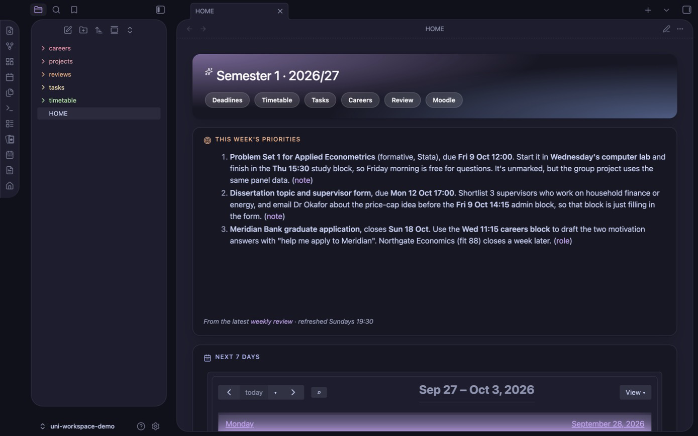
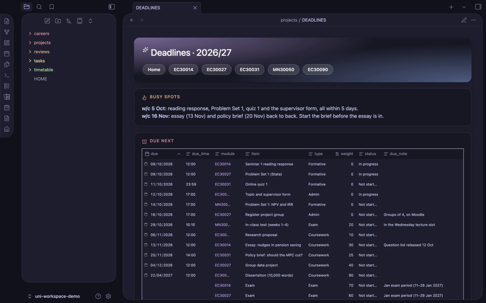
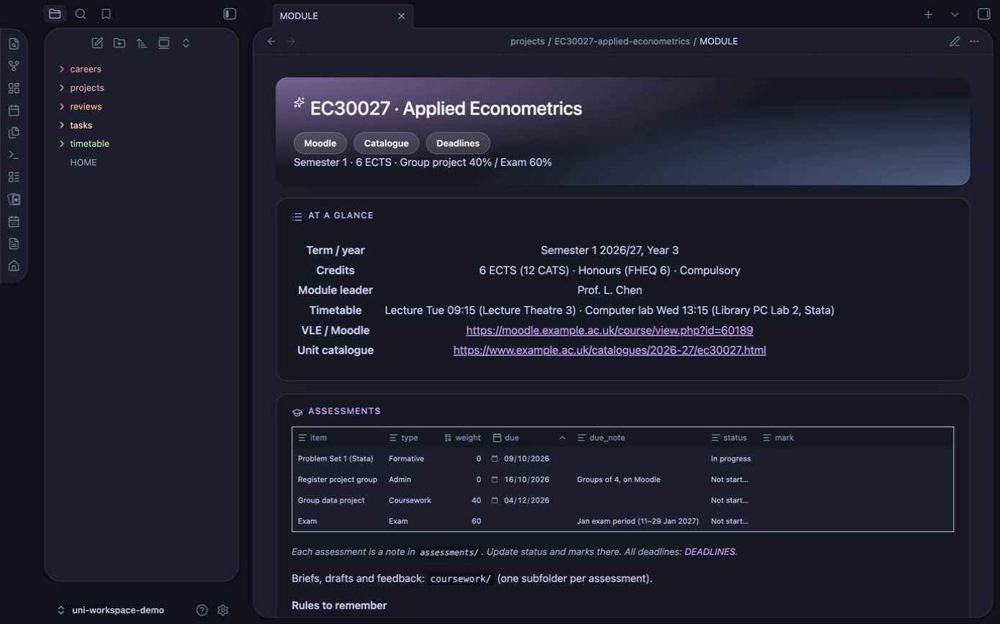
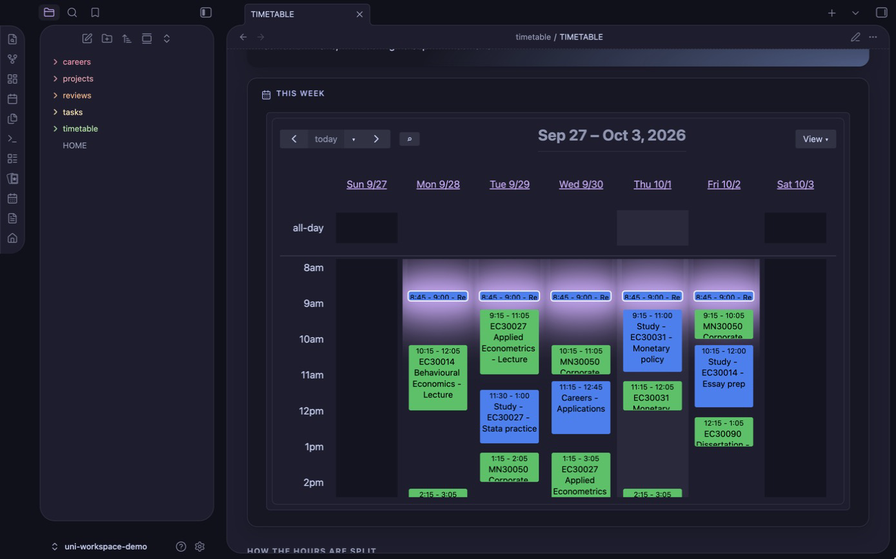
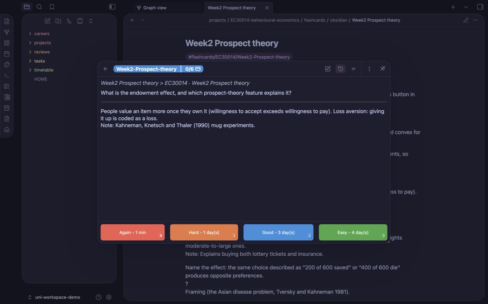
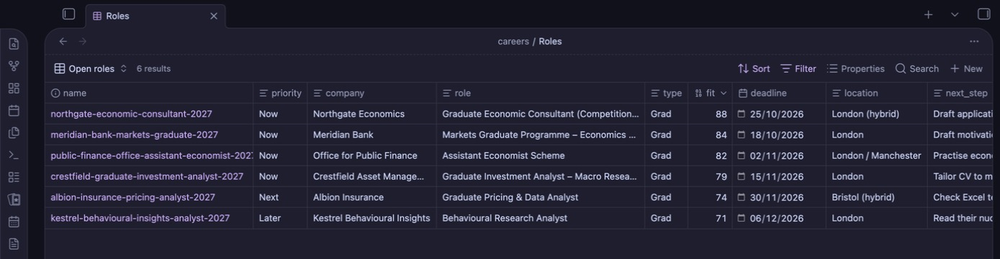

# claude-uni-workspace

**Your university year, run by [Claude Code](https://claude.com/claude-code) in an [Obsidian](https://obsidian.md) vault.**
Claude reads your Moodle and your university's official module specs, builds one folder per module with every
deadline as a note, then keeps it all current: a study timetable around your lectures, flashcards and exam practice
from your own lecture notes, a weekly review of the week ahead, and a scheduled graduate job search. Everything is
plain Markdown on your own computer, so the files are the memory rather than a chat history.



## What it does
| | Say | You get |
|---|---|---|
| **Modules and deadlines** | "set up" · "refresh Moodle" · "what's due?" | One folder per module (spec, outcomes, timetable, log), every assessment as a note, a year-wide deadline board, weekly Moodle updates |
| **Obsidian dashboards** | "set up Obsidian" | Card-style pages in the AnuPpuccin theme, opening in Reading view: HOME (priorities, week agenda, deadlines, graded work, roles), plus DEADLINES, TASKS, careers, the timetable and every module page. A colour-coded graph with a local-graph sidebar |
| **Home dashboard and tasks** | "task: email my supervisor by Fri" | A HOME page with this week's calendar, your priorities, deadlines in the next 14 days, graded work and roles to apply to, plus task notes |
| **Study timetable** | "make me a study timetable" | Study blocks fitted around lectures and your commitments, shown in Obsidian's calendar, clash-checked |
| **Flashcards** | "make flashcards for MA32064" | Definitions, theorem statements and proof ideas from your notes, one subdeck per chapter, plus a page saying which proofs to learn. Optional concept notes link ideas across modules in the graph |
| **Exam practice** | "quiz me on MA32064" | Past-paper and exam-style questions; send a photo of your handwritten answer and it's marked like an exam |
| **Weekly review** | "weekly review" (or every Sunday, automatically) | The week ahead on one page: calendar, study blocks, deadlines, tasks, email needing action, 3 priorities |
| **Careers** | "set up careers" · "find roles" · "help me apply to X" | A scheduled search for grad roles, internships or placements, ranked by fit to your CV, with per-application prep |

Built and tested against Moodle at the University of Bath. The skills are written for any Moodle-based
university, and other VLEs (Canvas, Blackboard) should work with minor guidance.

## What you need
- **The [Claude desktop app](https://claude.com/download)**, signed in, using its **Code** tab. Claude uses the app's
  built-in browser to open Moodle while you log in. (The terminal version of Claude Code, Codex and Gemini CLI also
  work. See [Other agents](#other-agents).)
- **[Obsidian](https://obsidian.md/download)** (free). The deadline boards, dashboards, calendar and flashcards are
  all Obsidian views. Just install it; Claude sets up the rest.
- **Git:** you don't need to install it yourself. Claude checks, and sets it up if it's missing (on a Mac you click
  **Install** in Apple's dialog; on Windows you approve the installer).
- **A GitHub account is not needed.** The template is public, so downloading it and getting updates work without one.
  You'd only need an account to report an issue or suggest a change.
- *Optional:* Google Calendar and Gmail connectors in Claude, if you want the weekly review to include your
  calendar and email. Both are read-only. If your uni email is Outlook, add an Outlook rule that redirects all mail
  to your Gmail (Settings → Mail → Rules; condition: *Apply to all messages*, action: *Redirect to*), so the review
  sees uni email too.

## Setup (about 15 minutes)
1. **Install [Obsidian](https://obsidian.md/download)** and the **[Claude desktop app](https://claude.com/download)**.
2. **Download the workspace.** Open the Claude app's **Code** tab (any folder is fine) and paste:

   > Install git if I don't have it, then clone github.com/Cassius2584/claude-uni-workspace into a new folder called uni-workspace in my home folder, and tell me how to start a new session there.

   If git is missing, Claude sets it up (on a Mac you click **Install** in Apple's dialog; on Windows you approve the
   installer). The folder goes in your home folder, not iCloud or OneDrive, so your CV and course notes stay on your computer.
3. **Start a new Code session in `uni-workspace`.** This matters: Claude loads the workspace's skills when a session
   starts in that folder. Also open the folder in Obsidian (**Open folder as vault** → `uni-workspace`).
4. **Say "set up".** One skill, `setup-workspace`, runs the rest in order:
   - **Obsidian:** you turn on community plugins once, then Claude opens each install page and you press **Install**
     and **Enable** (nothing is installed without your click);
   - **your year:** it asks for your university, degree and VLE, opens Moodle, and waits while **you** log in (it
     never types your password), shows you the modules it found, and builds everything once you confirm;
   - **extras**, if you want them: HOME dashboard and tasks, study timetable, flashcards, weekly review, careers.

   Interrupted? Say "set up" again and it carries on where it stopped.
5. **Next time**, open the `uni-workspace` folder in the Code tab and in Obsidian, and just talk ("what's due?",
   "refresh Moodle").

What gets installed in Obsidian:

| Install | For |
|---|---|
| **Spaced Repetition** (Stephen Mwangi) | Flashcards, reviewed from the Flashcards button in the sidebar |
| **Full Calendar Remastered** (Jovi Koikkara) | The study timetable as a week view, plus HOME's agenda, with every deadline in red in the all-day row. You add your university timetable's subscribe link as an *ICS* calendar |
| **Style Settings** (mgmeyers) | Applies the theme preset |
| **Homepage** (novov) | Opens HOME when Obsidian starts, in Reading view |
| **AnuPpuccin** theme | The Catppuccin look: Mocha, mauve accent, card layout, rainbow folders |

`projects/EXAMPLE-MA30001-linear-algebra/` is a fictional sample module. Setup hides it from Obsidian, along with the
`_template` folders and the repo's own files (README, AGENTS, LICENSE, CLAUDE.md), so your vault shows only your own
notes. They stay on disk because skills copy from the templates and `git pull` updates them, so don't delete them.
To see them again, turn off the `hide-template-files` CSS snippet.

<details>
<summary><b>Prefer to do it by hand?</b></summary>

1. Install [git](https://git-scm.com/downloads) (on a Mac: `xcode-select --install`), then clone the workspace:
   ```bash
   git clone https://github.com/Cassius2584/claude-uni-workspace.git ~/uni-workspace
   ```
2. Open `~/uni-workspace` in Obsidian (**Open folder as vault**) and in the Claude app's Code tab (or run `claude`
   inside it in a terminal).
3. Start a new session in that folder and say **"set up"**.
</details>

## Staying up to date
Keep the `.git` folder: it's how you get new skills and fixes. From time to time, run:
```bash
cd ~/uni-workspace && git pull
```
It's safe because `.gitignore` keeps **your** files (modules, profile, deadlines, tasks, timetable, reviews, CV,
applications) out of git, so pulling only touches the template and skills. You can't push to this repo, so
nothing of yours can leak. If you change a skill yourself, commit it on your own branch so pulls merge cleanly.

## Features

### Modules, deadlines and Moodle
`setup-year` builds, for each module:
```
projects/
├── DEADLINES.md                                 ← dashboard of every assessment: Due next · Graded only · Board · Modules · By module · Done
└── CM32032-reinforcement-learning/
    ├── MODULE.md          ← credits, outcomes, staff, timetable, log; embeds this module's assessments
    ├── assessments/       ← one note per assessment: due, weight, status, mark
    ├── lectures/  coursework/  resources/        ← your notes, briefs and drafts, and course files (never committed)
    └── flashcards/  practice.md  proof-tiers.md  ← revision (optional, see below)
```
See [`projects/EXAMPLE-MA30001-linear-algebra/`](projects/EXAMPLE-MA30001-linear-algebra/MODULE.md) for a filled-in
(fictional) module. Say **"refresh Moodle"** once a week and `sync-moodle` reports only what changed: moved dates first,
then new deadlines, announcements, files (downloaded only if you pick them) and the week's topics. It also predicts
recurring hand-ins such as fortnightly problem sheets before they're posted. It isn't automated on purpose: Moodle
sits behind single sign-on and 2FA, so you log in yourself, and Moodle's calendar export misses hidden assignments,
dates written in page text, and announcements.





### Tasks and home dashboard
"task: book a supervisor meeting by Friday" creates a note in `tasks/` (status, area, priority, due date), and
"done with …" closes it. `HOME.md` is the page to pin in Obsidian: today's schedule next to this week's agenda (lectures and
study blocks), this week's 3 priorities from the latest weekly review, everything due in the next 14 days, graded
coursework and exams ahead, tasks, and the roles to apply to now. When a coursework brief arrives, Claude can split it
into dated steps counted back from the deadline.

### Study timetable
Share your lecture timetable (a downloaded `.ics` export is best) and say **"make me a study timetable"**.
`create-study-timetable` asks a few questions (sport, clubs, a job, when you like to work, days off, weekly hours),
then fits study blocks into the gaps. The blocks are weighted by credits and deadlines, with review time after
lectures and extra blocks before each deadline. Every week of term is clash-checked against the real timetable,
including one-off events. Each block is a note in `timetable/blocks/`, so Full Calendar shows it and you can drag
it to move it. `timetable/TIMETABLE.md` shows the week grid and hours per module. It can also export an `.ics` for
Google or Apple Calendar, or add the events through a calendar connector (only if you say yes).



### Flashcards and proof tiers
**"Make flashcards for MA32064"** turns that module's notes and past papers into one source file,
`flashcards/cards.md`:
- definitions word for word, fill-in-the-blank theorem statements, "name the result" cards and worked examples;
- a proof card with a one-sentence key idea for every proof worth learning.

It's built into Spaced Repetition notes with one subdeck per chapter, so you only study what's been lectured. Anki is
also available if you prefer a phone app. Alongside it, a tiers page says how well to know each proof: **A** write
it out, **B** rebuild it from the key idea, **C** just state it. The tiers are calibrated against past papers.
After each lecture, "add cards for week 3" adds the new cards without touching your review history.



**Concept notes** (optional, offered after the cards): one note per theorem, method or proof technique in
`concepts/`, linked to every chapter and module it turns up in. Obsidian's graph then shows how your modules connect,
e.g. Markov chains shared by a statistics and an RL module. Open any note and the local graph in the right sidebar
shows its neighbours.

### Exam practice
**"Quiz me on MA32064"** sets a question: a real past-paper question when one fits the lectured material, otherwise
one written in the same style, with marks per part. The mark scheme is written **before** you answer and hidden from
you. Answer by hand, **send a photo**, and it's marked like an examiner would: exact definitions, key proof steps,
method and accuracy marks. You get a score per part, what you lost and why, and one line to remember. `practice.md`
logs every attempt and keeps a list of weak spots that come back after 2 days, a week or 3 weeks depending on how you did. In the
revision period, ask for a timed mock paper. It's for practice only, so it won't mark work you're submitting for credit.

### Weekly review
**"Weekly review"** (or a scheduled run every Sunday evening) writes `reviews/<date>.md`: next week's calendar and
study blocks, everything due in 14 days including predicted hand-ins, applications, tasks, flashcard chapters
to unlock, practice weak spots due, email needing action, and **3 priorities**. It only reads your notes and connectors,
and writes that one file.

### Careers: grad roles, internships, placements
**"Set up careers"** imports your CV and interviews you for a brief (role types, deal-breakers, dream employers),
then picks job boards to check.
- **`find-roles`** (scheduled or on demand) checks your boards (Bright Network, Prospects, TARGETjobs, Gradcracker,
  RateMyPlacement, LinkedIn, Indeed…), your target employers' careers pages and the wider web. It reads every job
  description, filters out roles you aren't eligible for, scores the rest against your CV, and writes a ranked
  digest: **Apply now / Worth a look / Stretch**.
- **`prep-application`** saves the job description, maps each requirement to evidence in your CV, drafts tailored
  CV bullets, a cover letter and STAR answers (real experience only), and lists likely tests and interview questions.
- Roles are notes viewed through `careers/Roles.base` (*Open roles · By deadline · Applications · Board*). A
  Markdown or spreadsheet tracker also works.

Claude never applies, fills in forms or logs in to job sites for you.



### Scheduled runs
The job search and weekly review can run on a schedule from the Claude desktop app (Code tab → Scheduled). Runs
happen while the app is open, and a missed run fires the next time you open it. With your OK, the setup adds a
**narrow** allow-list to `~/.claude/settings.json` (read the workspace, write only to its own folder, read-only
connector tools, never a blanket shell rule), so runs don't stall on approval prompts. Click **Run now** once to
confirm.

## Day to day
| Say | What happens |
|---|---|
| "What's due?" | The next two weeks of deadlines, tasks and applications, with what to do first (`whats-due`) |
| **"Refresh Moodle"** (weekly) | New or moved deadlines, announcements, files, weekly topics → `projects/updates/<date>.md` (`sync-moodle`) |
| "Here's the CW1 brief" + file | Filed in the right `coursework/` folder and logged |
| "I submitted the business plan" | Assessment note updated |
| "Add module MA32054" | Pulls the spec and adds the folder (`add-module`) |
| "task: …" / "done with …" | Task note created / closed |
| "Make me a study timetable" / "I've joined X on Wednesdays" | Timetable built / adjusted and re-checked (`create-study-timetable`) |
| "Make flashcards for MA32064" / "add cards for week 3" | Flashcards and proof tiers (`create-flashcards`) |
| "Quiz me on MA32064" → photo of your answer | Exam question, strict marking, weak spots logged (`exam-practice`) |
| "Weekly review" | The week ahead on one page (`weekly-review`) |
| "Find me new roles" / "help me apply to #2" | Job search now (`find-roles`) / application prep (`prep-application`) |

## Privacy and copyright
- Your modules, profile, deadlines, tasks, timetable, reviews, CV and applications are git-ignored. Only the
  template, skills and the fictional example are tracked.
- PDFs, slides, documents, zips, Anki decks and calendar files are ignored everywhere. Lecture notes and past papers are
  your university's copyright, so don't publish them.
- Claude never enters your password: you always log in yourself. Calendar and email connectors are only read.
- Keep the folder out of cloud-synced locations unless you trust the service with your CV and course materials.

## Other agents
It's built for Claude Code, but it's plain Markdown, so Codex, Gemini CLI or Cursor work too. They read
[`AGENTS.md`](AGENTS.md), which points to the same rules (`CLAUDE.md`) and maps each request to a skill file.
Your tool needs its own equivalent of a browser you can log in through (Moodle), web search (job search), and
scheduling (automatic runs). A plain chat window (claude.ai, ChatGPT) can explain the project but can't set it up.

> **🤖 If you're an AI assistant asked to set this up:** follow
> [AGENTS.md → "Setting this up for someone"](AGENTS.md#setting-this-up-for-someone) before doing anything else.

## What's inside
| Path | Purpose |
|---|---|
| `CLAUDE.md` | Rules Claude follows in every session |
| `AGENTS.md` | Entry point for other agents: points to `CLAUDE.md` and maps requests to skills |
| `.claude/skills/setup-workspace/` | "Set up": runs setup-obsidian, setup-year and the extras in order, resuming if interrupted |
| `.claude/skills/setup-year/` | First-run setup: VLE + unit catalogue → module folders, deadlines, optional extras |
| `.claude/skills/add-module/` | Add one module from a code, link, PDF or pasted spec |
| `.claude/skills/sync-moodle/` | Weekly Moodle refresh, including predicted recurring hand-ins |
| `.claude/skills/whats-due/` | Deadlines, tasks and applications with priorities |
| `.claude/skills/setup-obsidian/` | Plugins and theme checklist, plus the dashboard and hide-template-files CSS snippets, AnuPpuccin preset and graph presets (`assets/`) applied to your vault |
| `.claude/skills/create-study-timetable/` | Study blocks as calendar notes; clash check and `.ics` export in `scripts/timetable.py`; deadlines → all-day calendar notes in `scripts/sync_deadlines.py` |
| `.claude/skills/create-flashcards/` | Flashcards (Spaced Repetition, Anki optional), proof tiers and concept notes; builders in `scripts/` |
| `.claude/skills/exam-practice/` | Exam-style questions, photo answers marked against a pre-written scheme, practice log |
| `.claude/skills/weekly-review/` | Sunday review of the week ahead → `reviews/<date>.md` |
| `.claude/skills/setup-careers/`, `find-roles/`, `prep-application/` | Careers brief, scheduled role search, per-application prep |
| `projects/_template/` | `MODULE.md`, `assessment.md`, `PROFILE.md`, and the `DEADLINES.md` and `HOME.md` dashboards (tables inline) |
| `tasks/_template/` | `TASKS.md` (dashboard with inline views, plus the rules) and `task.md` |
| `careers/_template/` | Brief, CV and sources templates, and the Bases, Markdown and spreadsheet trackers |

## Licence
MIT
